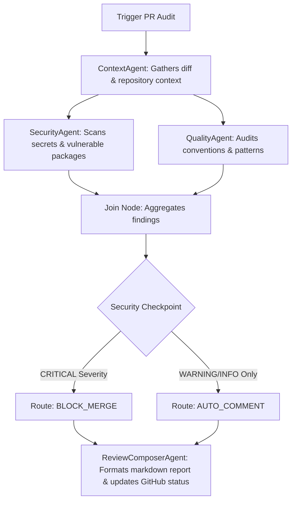

# PR Gatekeeper: AI-Powered Automated PR Auditor & DevOps Guardian

PR Gatekeeper is a production-grade, multi-agent automated code review system built to audit pull requests for security vulnerabilities, exposed secrets, and quality standards *before* human review. By acting as a checkpoint in the CI/CD pipeline, it dynamically decides whether a PR is safe to merge (`AUTO_COMMENT`) or should be blocked (`BLOCK_MERGE`).

Developed with **Google's Agent Development Kit (ADK)** and powered by **gemini-3.1-flash-lite / Pro**, this system demonstrates advanced multi-agent orchestration, parallel task execution, and custom **Model Context Protocol (MCP)** tool integration for devops and security automation.

---

## 🚀 Key Features

- **Multi-Agent Orchestration:** Coordinated execution of four specialized agents (`ContextAgent`, `SecurityAgent`, `QualityAgent`, and `ReviewComposerAgent`) managing complex state and parallel execution trees.
- **Automated Secrets Detection:** Uses automated MCP-connected scanners like Semgrep to detect hardcoded credentials, API keys, and sensitive configuration exposure in real-time.
- **Software Composition Analysis (SCA):** Automatically checks dependencies for vulnerability flags at the PR boundary.
- **Context-Aware Quality Audits:** Understands repository-wide conventions, missing authentication checks, error handling, and test-coverage requirements by fetching surrounding sibling files.
- **Pipeline Checkpoints:** Deterministic gatekeeping logic that translates security findings into branch-protection policies (`BLOCK_MERGE` or `AUTO_COMMENT`).
- **Interactive UI Playground:** Powered by the ADK local runtime to visualize agent decisions, execution flows, and real-time logs.

---

## 🛠️ Tech Stack & Architecture

### Technology Stack
- **Orchestration:** Google Agent Development Kit (ADK)
- **LLM Engine:** Gemini API (via `google-genai` SDK)
- **Integration Layer:** Model Context Protocol (MCP) Server with 7 custom tools
- **Security Scanners:** Semgrep, Custom Dependency Audit Tools
- **Environment:** Python 3.11+, `uv` (Fast Package Manager), Make

### Architecture Workflow
The system uses a parallel audit pipeline where findings are aggregated before hitting a deterministic checkpoint:



---

## 📦 Getting Started

### Prerequisites
- Python 3.11+
- [uv](https://docs.astral.sh/uv/) (Astral Python Package Manager)
- A Gemini API Key (obtainable via [Google AI Studio](https://aistudio.google.com/))

### Installation & Setup

1. **Clone the repository:**
   ```bash
   git clone <your-repo-url>
   cd pr-gatekeeper
   ```

2. **Configure environment variables:**
   Copy the template environment file and insert your `GOOGLE_API_KEY`:
   ```bash
   cp .env.example .env
   ```

3. **Install dependencies:**
   ```bash
   make install
   ```

4. **Launch the local runner & playground:**
   Start the interactive ADK visualization dashboard:
   ```bash
   make playground
   ```
   *Navigate to [http://localhost:18081](http://localhost:18081) to run live testing scenarios.*

---

## 🧪 Simulation Scenario Test Cases

You can run these payload scenarios inside the local ADK playground to test system routes:

### Scenario 1: Safe PR (`AUTO_COMMENT`)
- **Payload:**
  ```json
  {
    "pr_number": 1,
    "repo": "test/repo",
    "base_sha": "base123",
    "head_sha": "head123"
  }
  ```
- **Behavior:** The agent scans clean mock files, finds no critical flags, passes the security gate, and posts a positive, informative review comment.

### Scenario 2: Exposed Secrets (`BLOCK_MERGE`)
- **Payload:**
  ```json
  {
    "pr_number": 2,
    "repo": "test/repo",
    "base_sha": "base123",
    "head_sha": "head123"
  }
  ```
- **Behavior:** The `SecurityAgent` triggers Semgrep, catches an active API key in `config/settings.py`, flags it as a `CRITICAL` vulnerability, and blocks the merge.

### Scenario 3: Logical Vulnerability - Missing Authentication (`BLOCK_MERGE`)
- **Payload:**
  ```json
  {
    "pr_number": 3,
    "repo": "test/repo",
    "base_sha": "base123",
    "head_sha": "head123"
  }
  ```
- **Behavior:** The `QualityAgent` analyzes the new endpoint alongside surrounding files, detects missing authentication wrappers compared to repo conventions, and triggers a safety block.

---

## ⚡ Deployment & CI/CD Integration

To run PR Gatekeeper headlessly in your GitHub Actions pipeline:

```bash
uv run python -m app.cli_runner
```

Ensure the following environment variables are supplied by your GitHub workflow:
- `GOOGLE_API_KEY`
- `PR_NUMBER`
- `REPO`
- `BASE_SHA`
- `HEAD_SHA`

---

## 📁 Repository Structure

- `app/` — Main application logic: agents, config, MCP server, and runner.
  - `agent.py` — Multi-agent workflow definitions and checkpoint routers.
  - `cli_runner.py` — Headless entrypoint for CI/CD environments.
  - `mcp_server.py` — Custom Model Context Protocol server exposing repository tools.
- `tests/` — Suite of unit, integration, and evaluation tests.
- `assets/` — Visual architectural and promotional banners.
