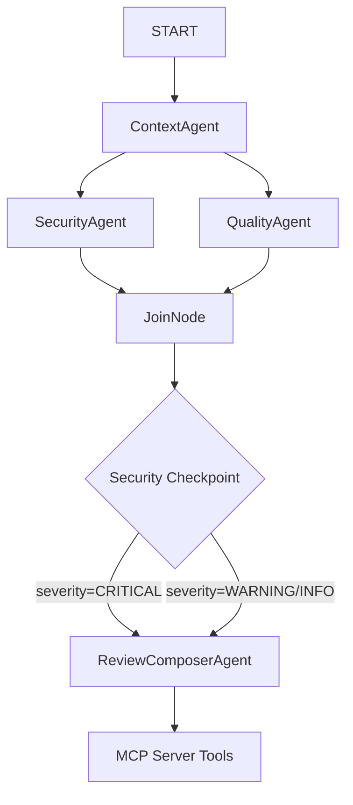

# PR Gatekeeper

Automated CI reviewer that audits PRs for secrets, missing auth, and security vulnerabilities to decide between `AUTO_COMMENT` and `BLOCK_MERGE`.

## Prerequisites

- Python 3.11+
- [uv](https://docs.astral.sh/uv/getting-started/installation/) Python package manager
- Gemini API Key from [Google AI Studio](https://aistudio.google.com/apikey)

## Quick Start

1. Clone this repository and navigate to the project directory:
   ```bash
   git clone <repo-url>
   cd pr-gatekeeper
   ```
2. Copy `.env.example` to `.env` and fill in your Gemini API key:
   ```bash
   cp .env.example .env
   ```
3. Install dependencies:
   ```bash
   make install
   ```
4. Start the interactive playground:
   ```bash
   make playground
   ```
   Open http://localhost:18081 in your browser to interact with the UI.

## Architecture



## How to Run

- **Interactive UI Testing**:
  ```bash
  make playground
  ```
- **Local Web Server**:
  ```bash
  make run
  ```
- **Unit & Integration Tests**:
  ```bash
  make test
  ```

## Sample Test Cases

### Test Case 1: Clean PR (Expected: AUTO_COMMENT)
- **Input**:
  ```json
  {
    "pr_number": 1,
    "repo": "test/repo",
    "base_sha": "base123",
    "head_sha": "head123"
  }
  ```
- **Expected**: `ContextAgent` loads mock clean files. No critical issues are found. Deterministic checkpoint routes to `AUTO_COMMENT`. `ReviewComposerAgent` writes a clean review comment.
- **Check**: Look for the posted review showing an `AUTO_COMMENT` decision and check run status in UI logs.

### Test Case 2: Hardcoded Secret (Expected: BLOCK_MERGE)
- **Input**:
  ```json
  {
    "pr_number": 2,
    "repo": "test/repo",
    "base_sha": "base123",
    "head_sha": "head123"
  }
  ```
- **Expected**: `run_semgrep` tool detects a hardcoded API key in `config/settings.py`. Checkpoint flags `CRITICAL` severity and routes to `BLOCK_MERGE`.
- **Check**: Review shows `BLOCK_MERGE` with the flagged secret in the table.

### Test Case 3: Missing Auth (Expected: BLOCK_MERGE)
- **Input**:
  ```json
  {
    "pr_number": 3,
    "repo": "test/repo",
    "base_sha": "base123",
    "head_sha": "head123"
  }
  ```
- **Expected**: `ContextAgent` fetches route files. `SecurityAgent` identifies that a new POST route handler in `src/routes/users.py` lacks session verification while sibling routes have one. Checkpoint flags `CRITICAL` and routes to `BLOCK_MERGE`.
- **Check**: Review identifies the insecure route handler.

## Troubleshooting

1. **`AttributeError: 'State' object has no attribute 'pr_number'`**:
   - Make sure you are using dictionary subscription (e.g. `ctx.state["pr_number"]`) since ADK's state object does not support dot-notation attribute access.
2. **`403 PERMISSION_DENIED`**:
   - Ensure your `GOOGLE_API_KEY` in `.env` is updated and valid.
3. **`Session not found`**:
   - Verify that the App name in `App(name="app")` matches the folder name `app` exactly.

## Push to GitHub

1. Create a new repo at https://github.com/new
   - Name: pr-gatekeeper
   - Visibility: Public or Private
   - Do NOT initialize with README (you already have one)

2. In your terminal, navigate into your project folder:
   ```bash
   cd pr-gatekeeper
   ```
   ```bash
   git init
   git add .
   git commit -m "Initial commit: pr-gatekeeper ADK agent"
   git branch -M main
   git remote add origin https://github.com/<your-username>/pr-gatekeeper.git
   git push -u origin main
   ```

3. Verify `.gitignore` includes:
   ```text
   .env          ← your API key — must NEVER be pushed
   .venv/
   __pycache__/
   *.pyc
   .adk/
   ```

⚠ NEVER push `.env` to GitHub. Your API key will be exposed publicly.

## Assets

### Architecture Diagram


Shows the full multi-agent workflow: START → ContextAgent → [SecurityAgent ‖ QualityAgent] → JoinNode → security_checkpoint → ReviewComposerAgent → DONE.  
The MCP Server (7 tools) is connected to all four agents.

### Cover Banner


## Demo Script

See [DEMO_SCRIPT.txt](DEMO_SCRIPT.txt) for a full spoken walkthrough (~3–4 minutes) covering the architecture, live demo of all 3 test cases, and a closing impact statement.
