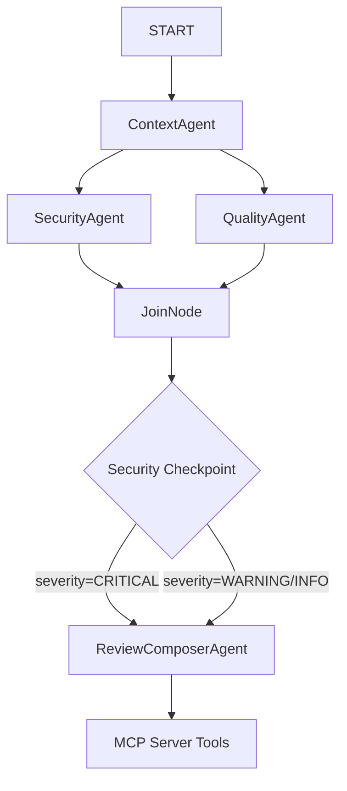

# PR Gatekeeper — Submission Writeup

## Problem Statement

Vibe-coded PRs land faster than human reviews can keep up. Standard static analysis tools check patterns but lack contextual reasoning (e.g. verifying if a newly added write route conforms to auth validation patterns of sibling routes). This agent solves that bottleneck by providing automated, context-aware pre-merge checks in CI.

## Solution Architecture

## Concepts Used

- **ADK Workflow**: Configured in [agent.py](file:///wsl2ubuntu/home/jarvis/dev/learning/adk-workspace/pr-gatekeeper/app/agent.py#L191-L207) to coordinate parallel audit steps.
- **LlmAgent**: Used for `ContextAgent`, `SecurityAgent`, `QualityAgent`, and `ReviewComposerAgent` in [agent.py](file:///wsl2ubuntu/home/jarvis/dev/learning/adk-workspace/pr-gatekeeper/app/agent.py#L42-L114).
- **MCP Server**: Defined in [mcp_server.py](file:///wsl2ubuntu/home/jarvis/dev/learning/adk-workspace/pr-gatekeeper/app/mcp_server.py) to decouple system tools from agent logic.
- **Security Checkpoint**: The deterministic node `security_checkpoint()` in [agent.py](file:///wsl2ubuntu/home/jarvis/dev/learning/adk-workspace/pr-gatekeeper/app/agent.py#L153-L171) filters findings and decides routing.
- **Agents CLI**: Scaffolded using `agents-cli scaffold`.

## Security Design

1. **Deterministic Checkpoint**: Route selection (`BLOCK_MERGE` vs `AUTO_COMMENT`) is resolved by a python conditional block, not LLM vibes.
2. **Secrets Scanning**: Decoupled to verified SAST scanners (`semgrep`) instead of regex patterns.
3. **Audit Trails**: One structured JSON audit log per run printed to stdout for compliance tracing.
4. **Least-Privilege Token**: Wirings require content-read and pull-request/checks write permissions only.

## MCP Server Design

Located in [mcp_server.py](file:///wsl2ubuntu/home/jarvis/dev/learning/adk-workspace/pr-gatekeeper/app/mcp_server.py):
- `get_pr_diff` / `get_pr_files`: Unified diff retrieval.
- `get_file_context`: Baseline retrieval of sibling codebase routes.
- `run_semgrep`: Local filesystem secret detection.
- `run_sca_scan`: Evaluates lockfiles against vulnerable dependency DBs.
- `post_pr_comment` / `set_check_run_status`: Posting reviews to GitHub (safety gated: dry-runs unless `GATEKEEPER_LIVE=true`).

## HITL Flow

In PR reviews, the human reviewer is the natural center of the HITL loop. The agent publishes the structured audit reports as a comment but does not automatically merge. A human developer must review the findings, address the blocks, and complete the merge once status checks clear.

## Demo Walkthrough

1. **Test Case 1 (Clean PR)**: Confirms correct execution flow without any warnings. Checkpoint yields `AUTO_COMMENT`.
2. **Test Case 2 (Hardcoded Secret)**: Semgrep spots a hardcoded Stripe API Key. Checkpoint yields `BLOCK_MERGE`.
3. **Test Case 3 (Missing Auth)**: LLM compares routing against sibling files and detects lack of session authentication. Checkpoint yields `BLOCK_MERGE`.

## Impact / Value Statement

Engineering teams can significantly reduce their manual security inspection load, allowing developers to receive instantaneous feedback on security vulnerabilities and styling standards inside their existing GitHub workflow.
