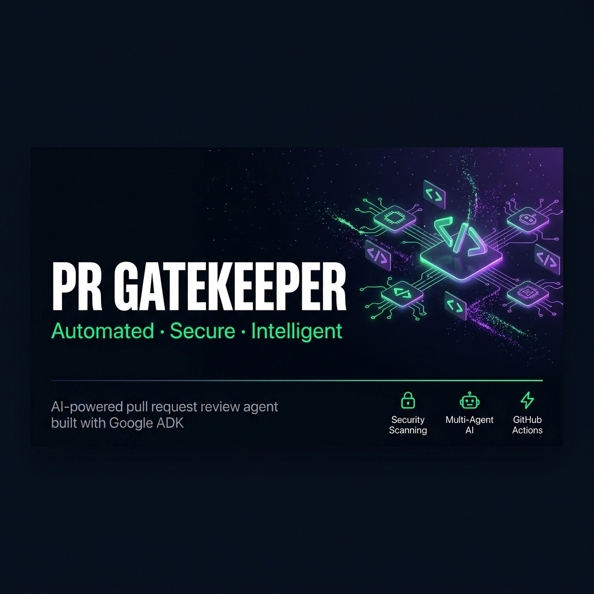
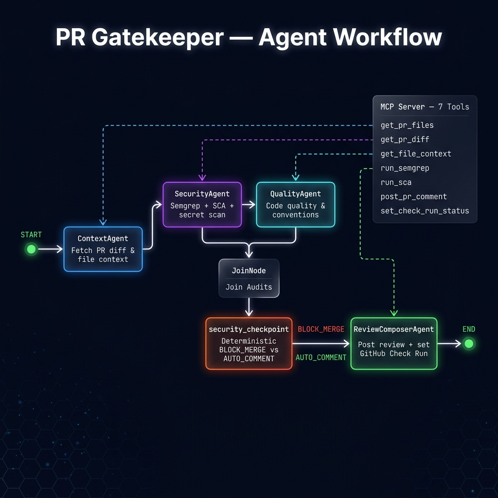
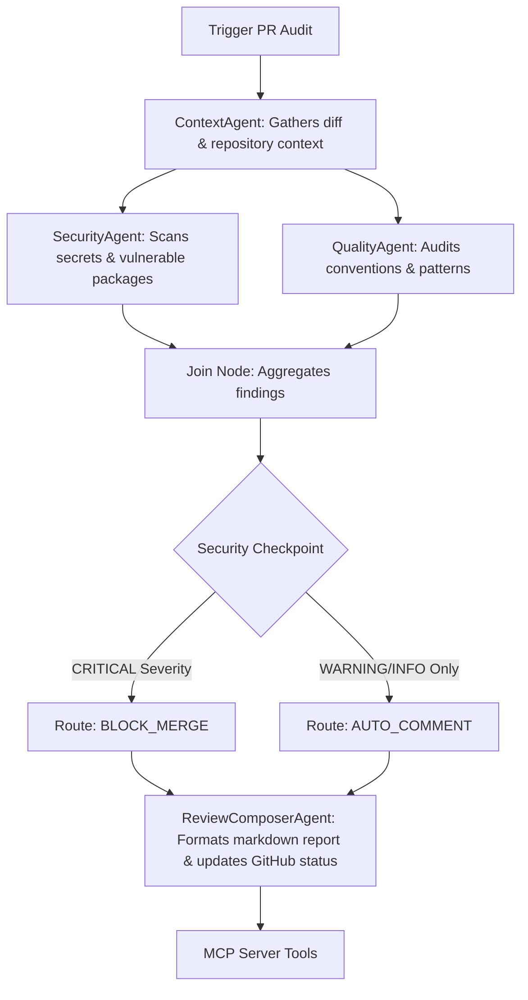

# PR Gatekeeper — Submission Writeup

## Basic Details

### Title
PR Gatekeeper

### Subtitle
Automated, context-aware pre-merge code security and quality audits in CI.

### Card and Thumbnail Image
- **Cover Banner**: 

### Submission Tracks
- **Agents for Business** (Target Track: automating enterprise devops and code inspection workloads to reduce engineering review overhead).

### Media Gallery
- **Architecture Diagram**: 

---

## Content

### Project Description

#### Problem Statement
Vibe-coded PRs land faster than human reviews can keep up. Standard static analysis tools check patterns but lack contextual reasoning (e.g., verifying if a newly added write route conforms to auth validation patterns of sibling routes). This agent solves that bottleneck by providing automated, context-aware pre-merge checks in CI.

#### Solution Architecture

#### Key Hackathon Concepts Demonstrated

Our implementation directly applies **five (5) key concepts** from the *5-Day AI Agents course*:

1. **Agent / Multi-agent system (ADK)**:
   Coordinated multi-agent orchestration configured using a custom Google ADK Workflow (`Workflow`) in [agent.py](file:///wsl2ubuntu/home/jarvis/dev/learning/adk-workspace/pr-gatekeeper/app/agent.py#L191-L207). It routes code diffs through parallel specialist agents (`ContextAgent`, `SecurityAgent`, and `QualityAgent`) and merges findings via a join node.
2. **Model Context Protocol (MCP) Server**:
   A dedicated MCP server, defined in [mcp_server.py](file:///wsl2ubuntu/home/jarvis/dev/learning/adk-workspace/pr-gatekeeper/app/mcp_server.py), decouples system tooling (retrieving repository files, running Semgrep scans, auditing lockfiles, posting PR comments) from LLM orchestration logic.
3. **Security Features**:
   - **Deterministic Checkpoint**: Decision logic (`security_checkpoint` in [agent.py](file:///wsl2ubuntu/home/jarvis/dev/learning/adk-workspace/pr-gatekeeper/app/agent.py#L153-L171)) is strictly coded in Python, preventing "vibes" from bypassing security rules.
   - **Secrets & SCA Integration**: Integrates Semgrep and SCA dependency scanning to safely check for exposed credentials and known package vulnerabilities.
4. **Agent Skills (Agents CLI)**:
   Scaffolded and managed using the `agents-cli` toolset to maintain compatibility with modern agent deployment standards.
5. **Antigravity Coding Companion**:
   Developed and paired with **Antigravity** (your AI coding companion) to iterate on unit testing, optimize system prompts, and format artifacts seamlessly.

---

#### Detailed Design

##### Security Design
1. **Deterministic Checkpoint**: Route selection (`BLOCK_MERGE` vs `AUTO_COMMENT`) is resolved by a python conditional block, not LLM vibes.
2. **Secrets Scanning**: Decoupled to verified SAST scanners (`semgrep`) instead of regex patterns.
3. **Audit Trails**: One structured JSON audit log per run printed to stdout for compliance tracing.
4. **Least-Privilege Token**: Wirings require content-read and pull-request/checks write permissions only.

##### MCP Server Design
Located in [mcp_server.py](file:///wsl2ubuntu/home/jarvis/dev/learning/adk-workspace/pr-gatekeeper/app/mcp_server.py):
- `get_pr_diff` / `get_pr_files`: Unified diff retrieval.
- `get_file_context`: Baseline retrieval of sibling codebase routes.
- `run_semgrep`: Local filesystem secret detection.
- `run_sca_scan`: Evaluates lockfiles against vulnerable dependency DBs.
- `post_pr_comment` / `set_check_run_status`: Posting reviews to GitHub (safety gated: dry-runs unless `GATEKEEPER_LIVE=true`).

##### HITL Flow
In PR reviews, the human reviewer is the natural center of the HITL loop. The agent publishes the structured audit reports as a comment but does not automatically merge. A human developer must review the findings, address the blocks, and complete the merge once status checks clear.

##### Demo Walkthrough
1. **Test Case 1 (Clean PR)**: Confirms correct execution flow without any warnings. Checkpoint yields `AUTO_COMMENT`.
2. **Test Case 2 (Hardcoded Secret)**: Semgrep spots a hardcoded Stripe API Key. Checkpoint yields `BLOCK_MERGE`.
3. **Test Case 3 (Missing Auth)**: LLM compares routing against sibling files and detects lack of session authentication. Checkpoint yields `BLOCK_MERGE`.

##### Impact / Value Statement
Engineering teams can significantly reduce their manual security inspection load, allowing developers to receive instantaneous feedback on security vulnerabilities and styling standards inside their existing GitHub workflow.

---

### Project Links
- **GitHub Repository**: [ashrafulhaque/pr-gatekeeper](https://github.com/ashrafulhaque/pr-gatekeeper)
- **Demo Video**: [Link to YouTube demo video / walkthrough](https://youtu.be/fWAmPgcECEc?si=qLJTPw3z2F-TzXR4)
